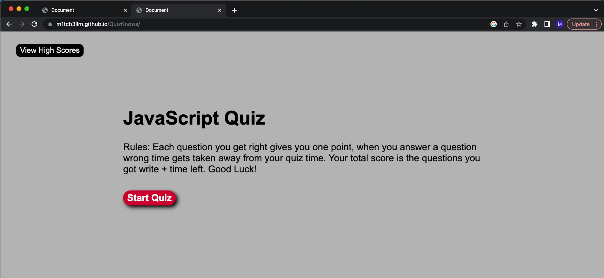

##JavaScript Quiz App

Welcome to the JavaScript Quiz App! This is a simple web application that allows users to test their knowledge of JavaScript concepts through a quiz. The app includes a timer, a variety of questions, and a scoring system.

#Table of Contents

Features
Usage
Link
Picture

#Features

Multiple-choice questions to test JavaScript knowledge.
A timer that counts down as you progress through the quiz.
Scoring system that calculates the final score based on correct answers and time left.
User input for storing and displaying scores with names.

#Usage

To use the JavaScript Quiz App:

Click the "Start" button to begin the quiz.
Read each question carefully and click on your chosen answer.
Your score will be updated based on correct answers and the time remaining.
At the end of the quiz, you can input your name and submit your score.

#Link

[Link to Quiz](https://m1tch3llm.github.io/QuizKnows/)

#Photo

